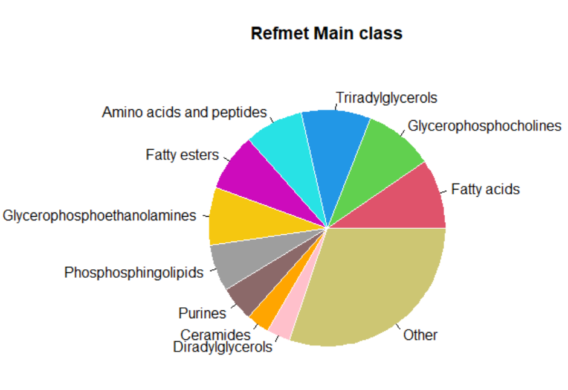

R-based tools for standardization of metabolite names (RefMet)
================

## Overview
The main objective of <a href=https://www.metabolomicsworkbench.org/databases/refmet/index.php>RefMet</a> is to provide a standardized reference nomenclature for both discrete metabolite structures and metabolite species identified by spectroscopic techniques in metabolomics experiments. The wide range of available analytical methods coupled with the even wider range of metabolite databases and in-house libraries has unfortunately led to a pervasive problem wherein the same metabolite species may be reported by many different names. This nomenclature issue represents a significant barrier for comparative analysis of metabolomics data across studies generated by different institutions and/or platforms. We have used data from over 3,000 MS and NMR studies on the Metabolomics Workbench to develop a highly curated analytical chemistry-centric list of common names for metabolite structures and isobaric species. This nomenclature is also linked to a metabolite classification system. A name-conversion user interface is provided where users can submit a list of metabolite names and map them to the corresponding RefMet names. RefMet has the ability to greatly increase the data-sharing potential of metabolomics experiments and facilitate "meta-analysis" and systems biology objectives for the majority of commonly encountered metabolite species.</br>
These R-based tools enable users to map a list of metabolite names (from a text file or a data frame column) to RefMet nomenclature in batch mode, gain access to RefMet metadata for metabolites and perform plotting and saving functions.</br>
<strong>Reference:</strong> <a href=https://rdcu.be/caRk5>RefMet: a reference nomenclature for metabolomics</a> (Nature Methods, 2020)


## Installation

To install the current version:

``` r
devtools::install_github("eoindfahy/RefMet")
```

Load RefMet in R:

``` r
library(RefMet)
```

## Usage
``` r
#Use a text file of metabolite names as input
infile <- system.file("extdata", "met_list.txt", package = "RefMet")
RefMet_mapped <- refmet_map(infile)
head(RefMet_mapped[,1:4])

                    Input.name           Standardized.name       Formula Exact.mass
1              2'-Deoxyuridine                Deoxyuridine     C9H12N2O5   228.0746
2      4-hydroxyphenylpyruvate 4-Hydroxyphenylpyruvic acid        C9H8O4   180.0423
3              acetylcarnitine                     CAR 2:0      C9H17NO4   203.1158
4 Acylcarnitine (C10:0) [M+H]+                    CAR 10:0     C17H33NO4    315.241
5       Adenosine triphosphate                         ATP C10H16N5O13P3   506.9958
6                          Asn                  Asparagine      C4H8N2O3   132.0535

#Use a data frame column containing metabolite names as input
DF <- read.table(infile, header = TRUE,  quote = "", sep="\t");
RefMet_mapped <- refmet_map_df(DF[,1])
head(RefMet_mapped[,c(2,5,6,7)])

            Standardized.name   Super.class               Main.class                       Sub.class
1                Deoxyuridine Nucleic acids              Pyrimidines Pyrimidine deoxyribonucleosides
2 4-Hydroxyphenylpyruvic acid Organic acids         Phenylpropanoids                  Cinnamic acids
3                     CAR 2:0   Fatty Acyls             Fatty esters                 Acyl carnitines
4                    CAR 10:0   Fatty Acyls             Fatty esters                 Acyl carnitines
5                         ATP Nucleic acids                  Purines                     Purine rNTP
6                  Asparagine Organic acids Amino acids and peptides                     Amino acids

#Plot RefMet main class distribution of metabolite list as a pie chart
#Options are:'Super class','Main class','Sub class'
classplot('Main class',RefMet_mapped)
```
<p align="center">
  
</p>

``` r
#Fetch metadata for a RefMet name
metadata<- refmet_metadata("Tyrosine")
head(metadata[,1:8])

  analysis    study refmet_name kegg_id                   inchi_key pubchem_cid   super_class               main_class
1 AN002455 ST001479    Tyrosine  C00082 OUYCCCASQSFEME-QMMMGPOBSA-N        6057 Organic acids Amino acids and peptides
2 AN004625 ST002832    Tyrosine  C00082 OUYCCCASQSFEME-QMMMGPOBSA-N        6057 Organic acids Amino acids and peptides
3 AN004375 ST002484    Tyrosine  C00082 OUYCCCASQSFEME-QMMMGPOBSA-N        6057 Organic acids Amino acids and peptides
4 AN001592 ST000972    Tyrosine  C00082 OUYCCCASQSFEME-QMMMGPOBSA-N        6057 Organic acids Amino acids and peptides
5 AN003632 ST002223    Tyrosine  C00082 OUYCCCASQSFEME-QMMMGPOBSA-N        6057 Organic acids Amino acids and peptides
6 AN004626 ST002832    Tyrosine  C00082 OUYCCCASQSFEME-QMMMGPOBSA-N        6057 Organic acids Amino acids and peptides

head(metadata[,9:15])

    sub_class               species          sample        disease analysis_type    polarity chromatography_type
1 Amino acids                 Mouse           Brain Leigh syndrome          LCMS    POSITIVE      Reversed phase
2 Amino acids Bacteroides uniformis Bacterial cells                         LCMS    POSITIVE               HILIC
3 Amino acids                 Human           Blood         Autism          GCMS    POSITIVE                  GC
4 Amino acids                Baboon           Blood                         GCMS    POSITIVE                  GC
5 Amino acids                 Mouse          Kidney         Cancer          LCMS UNSPECIFIED               HILIC
6 Amino acids      Blautia producta Bacterial cells                         LCMS    NEGATIVE               HILIC

#Plot a bargraph of species distribution of Tyrosine in NMDR studies (Top 10 species)
#Options are 'Species','Sample source','Disease association','Analysis type','MS polarity','Chromatography'
metplot('Species', metadata)
```
<!-- -->

## Contact

Eoin Fahy, University of California San Diego (efahy@ucsd.edu)

------------------------------------------------------------------------


